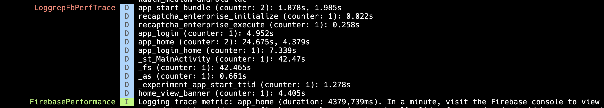

### Description

This filter is to extract trace events from Firebase Performance in realtime.

### Setup

Enable Firebase Performance logs.

[Shortcut to Firebase Doc](https://firebase.google.com/docs/perf-mon/get-started-android#view-log-messages):
```xml
<application>
    <meta-data
      android:name="firebase_performance_logcat_enabled"
      android:value="true" />
</application>
```

### Usage

```shell
yarn loggrep logcat -f lib/filters/firebase/perfTrace.ts
```

### Output

Every new event will log the `LoggrepFbPerfTrace` report.
It contains a counter for each event and all event durations:

